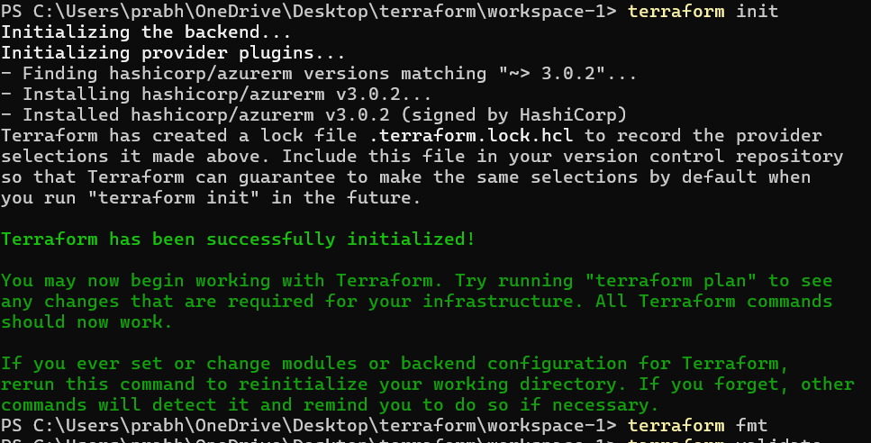
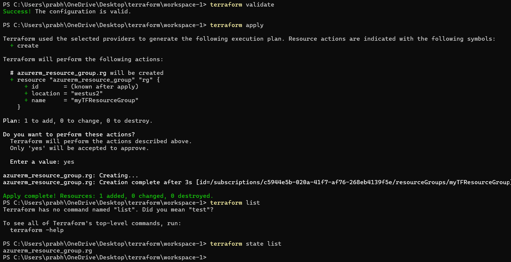

## Basic Build workflow

**Azure environment**

Set Environment variables for login
  --> terraform init
     --> terraform fmt
        --> terraform validate
            --> terraform apply
                --> terraform state list

