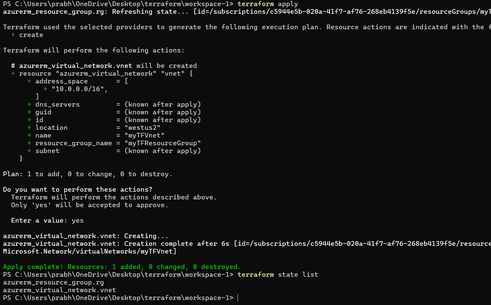
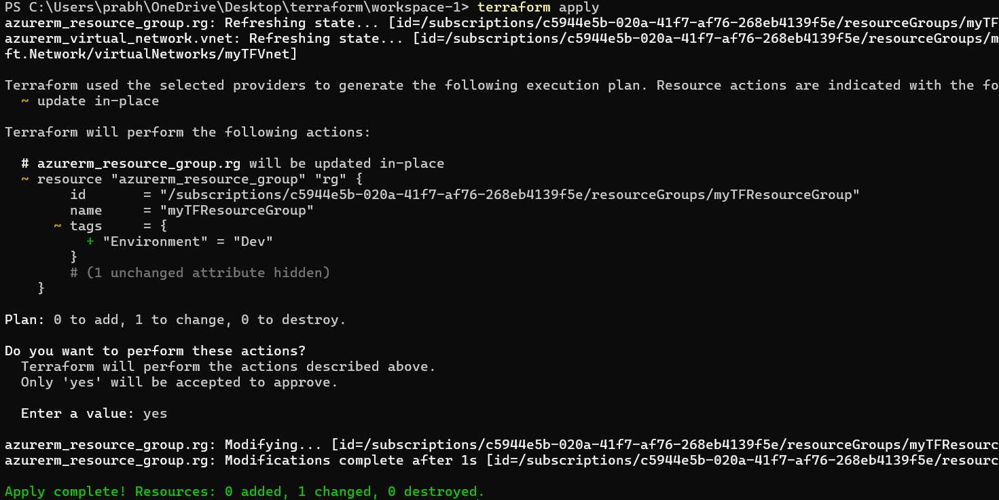
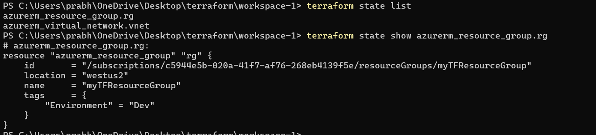

## Basic change workflow

### 1. Adding a new resource

Code to .tf -> terraform apply

Created a new vnet in an existing resource group 

### 2. Changing an existing resource

Code to .tf -> terraform apply

Terraform compares existing state with new changes proposed before applying

added a tag to an existing resource group

### 3. Review updated state

terraform state list -> gives list of all resources managed in this workspace

terraform show -> shows all properties tracked for a particular resource group

