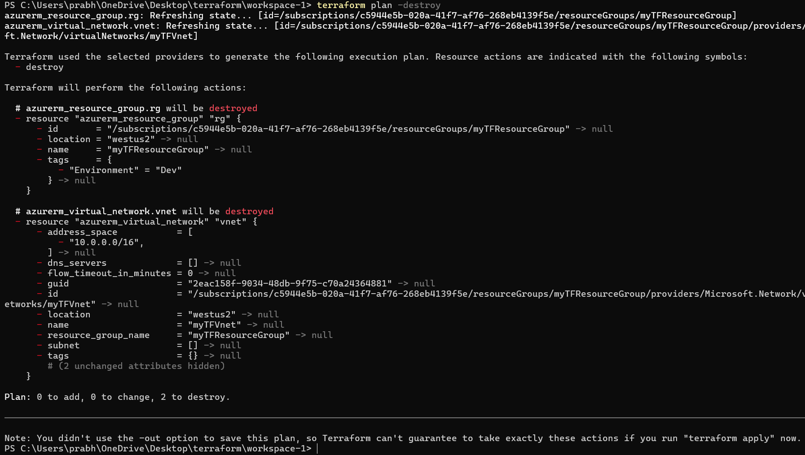
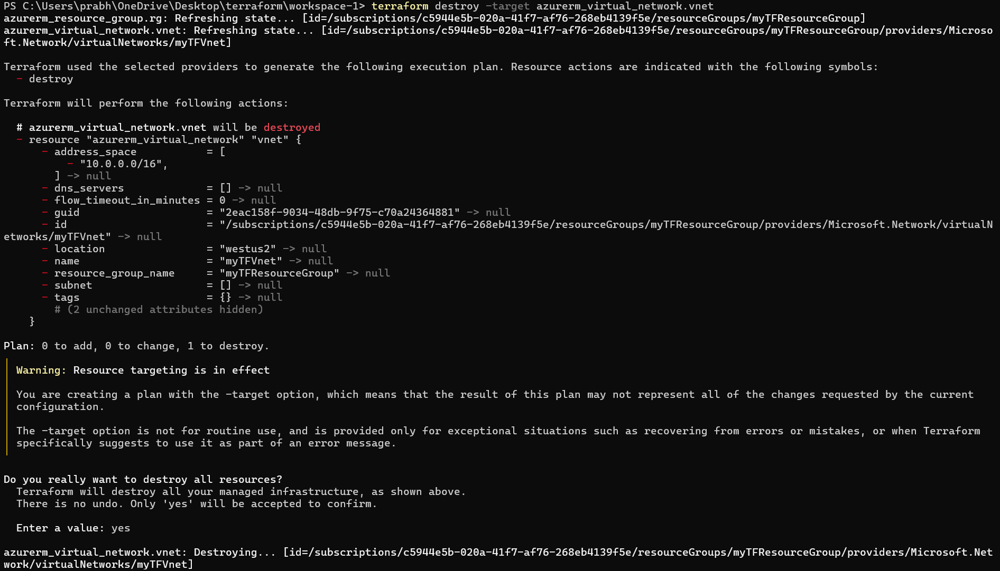

## Basic destroy optons

1. Old vs new method:

    terraform destroy - old

    terraform apply -destroy - new
    (alias terraform destroy)

2. Speculative plan:

    terraform plan -destroy  # to get speculative plan

3. Specific resource:

    terraform destroy -target provider.name

