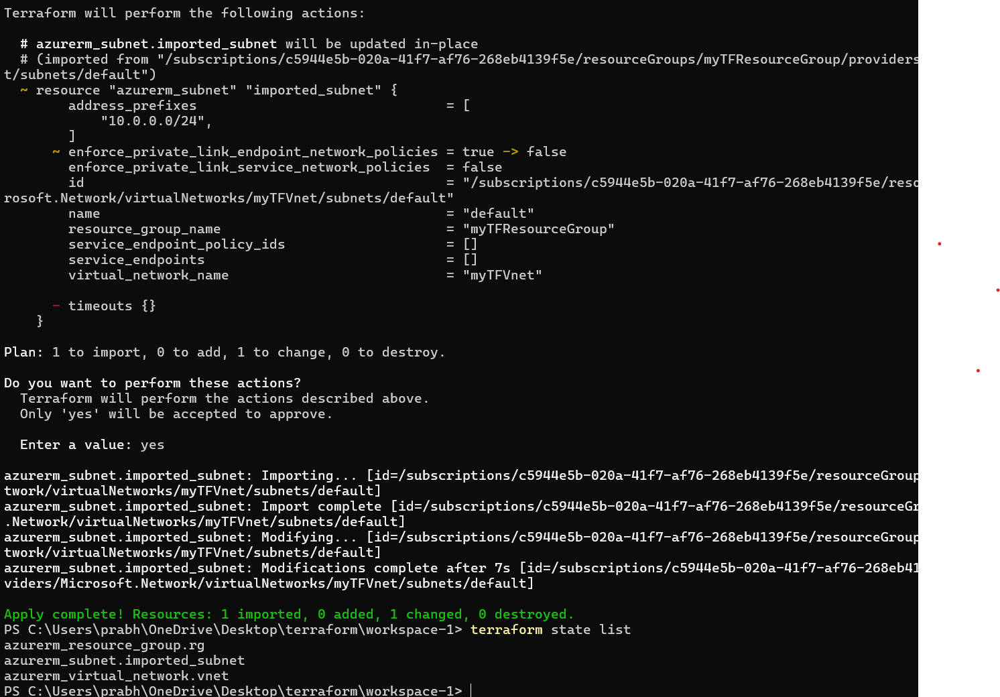

## Terraform import

Consider a workspace already tracking few resources, now we need to add an existing resource to this workspace for tracking.

Scenario:

|resource | tracked ?|
|--|--|
|resource group | yes |
|vnet | yes
|subnet | no|

workflow:

we have two options,

1. define basic resource info in .tf & then "terrafom import target_address resource_id "
2. using import block inside .tf along with basic resource info & then "terraform apply"

I have used option 2 as it seems more elegant approach,

main.tf

...

import {
  to = azurerm_subnet.imported_subnet
  id = "/subscriptions/****/resourceGroups/myTFResourceGroup/providers/Microsoft.Network/virtualNetworks/myTFVnet/subnets/default"
}

#importing an existing subnet
resource "azurerm_subnet" "imported_subnet" {
  name                 = "default"
  resource_group_name  = azurerm_resource_group.rg.name
  virtual_network_name = azurerm_virtual_network.vnet.name
}

...

