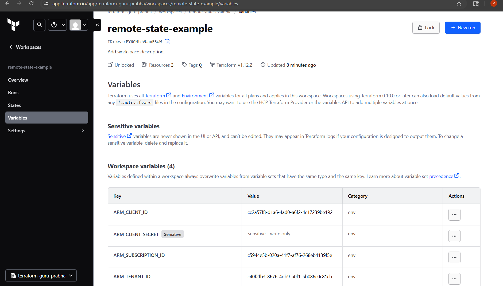
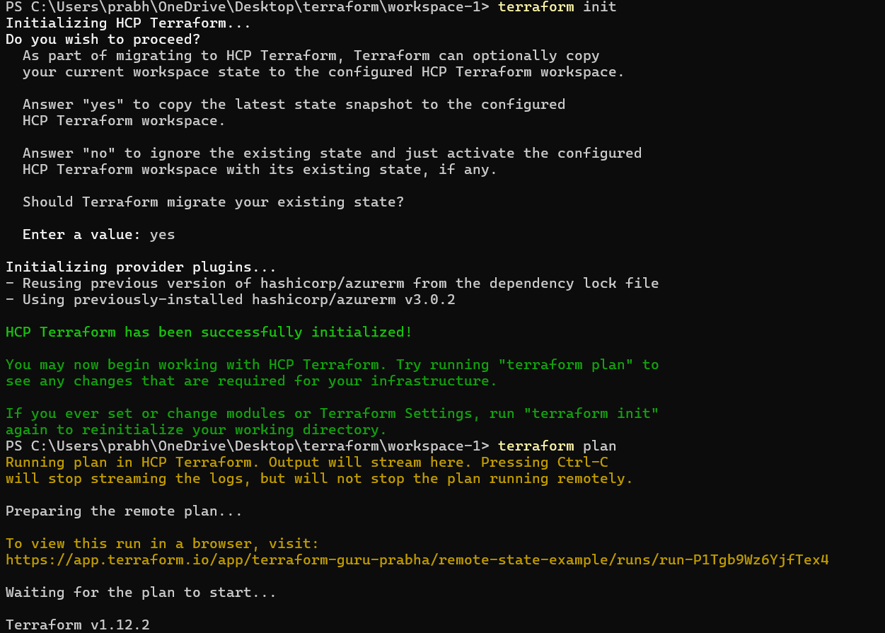
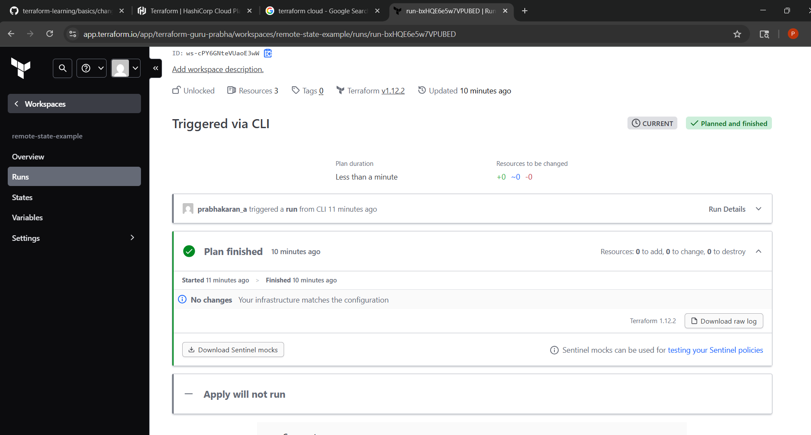

## Remote state management in Terraform cloud

We can keep the state management backend in terraform cloud and cli execution in our local/server. This option can help a team to collaborate on workspace.

Locking mechanism can help preventing two users applying some changes simultaneously. We can store variables, secrets in terraform cloud securely.

How I migrated from my local to remote:

1. Setting up cloud workspace:

    Created a new workspace for this setup.

2. Adding Env variables:

    To manage Azure resources we need to have following ENV variables in the workspace,

    ARM_SUBSCRIPTION_ID	, ARM_CLIENT_ID, ARM_CLIENT_SECRET (must be stored as sensitive) , ARM_TENANT_ID

3. Add workspace details in the main.tf terraform config

    cloud {

    organization = "terraform-guru-prabha"

    workspaces {
      name = "remote-state-example"
    }
  }

4. Terraform login using a token:

    We need to generate a login token in terraform cloud and provide it when prompted during 'terraform login' command.

5. Terraform init:

    This command detects that backend changed and prompt us if we want to proceed to migration to remote backend.
    Once we provide yes, sets up remote backend.

6. Terraform plan / apply:

    The runs are triggered from our local but the actual execution happens in a remote machine managed by terraform

Screenshots:

